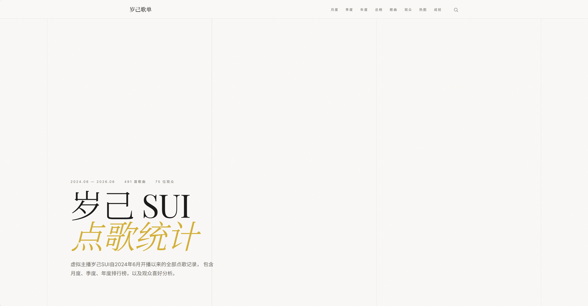

# 岁己 SUI · 点歌统计

虚拟主播**岁己SUI**的点歌数据可视化网站，以 Luxury / Editorial 美学风格展示自 2024 年 6 月以来的全部点歌记录。



## 访问地址

在线版：[https://stats.suijisui.uk](https://stats.suijisui.uk)

本地使用：双击 `index.html` 即可在浏览器中打开。

## 数据概览

基于岁己SUI自 **2024年6月** 至今的全部点歌记录，共 810 条记录、81 位观众、496 首歌曲。

## 功能一览

### 排行榜
- **月度点歌榜** — 25 个月份可切换，左右箭头 + 下拉菜单
- **季度点歌榜** — 按季度统计，左右箭头 + 下拉菜单
- **年度点歌榜** — 按年度统计，2024 / 2025 / 2026
- **总点歌榜** — 所有时间累计排行
- **热门歌曲榜** — 被点次数最多的歌曲排行

### 数据可视化
- **点歌趋势** — 柱状图展示每月点歌活跃度
- **观众喜好分析** — TOP 9 观众的偏好歌曲

### 创意功能
- **Hero SUI 动画** — 页面首屏右侧金色线条渐显，组合成 SUI 字样
- **数字动画** — 进入页面时统计数字从 0 滚动到真实数值
- **观众等级系统** — Lv.1 ~ Lv.5 五级徽章，显示在榜单名字旁边
- **成就殿堂** — 点歌之王成就卡片
- **跨月冠军追踪** — 连续多月霸榜记录，Vaserkia 最长 3 连冠
- **观众相似度** — 点击观众可见品味最相近的 3 人及重叠歌曲数
- **全局搜索** — 导航栏放大镜图标，支持搜索歌曲 / 观众 / 日期
- **歌曲搜索详情** — 搜索歌曲点击后弹出面板，展示哪些观众点过该歌曲，含点歌次数和日期；热门歌曲榜也可点击
- **B站主页直跳** — 已获取 35 位观众的 UID，一键跳转 B站个人空间；未获取到的降级为精准用户搜索
- **月度连续点歌** — 当月有连续两天点歌的用户标记 🔥，悬停可见是哪两首
- **一键复制** — 点击观众名弹出详情后，可一键复制用户名、上次点歌日期、本月点歌数
- **时间范围筛选** — 页脚点击「时间筛选」，自定义起止日期查看区间内统计
- **导出功能** — 每个榜单支持导出 PNG 高清截图（前 10 / 完整）、XLSX、CSV、JSON

### 交互细节
- 榜单默认显示前 10 名，点击「展开全部」查看完整排名
- 点击观众名字弹出详情面板，查看该观众点过的所有歌曲
- 观众详情面板显示「上一次点到歌距今 X 天」及「品味相近」
- 鼠标悬停歌名时，右侧渐显该观众点这首歌的日期
- 金色皇冠标识每个榜单的冠军
- 深色 / 浅色板块交替布局
- 提供 chanelog.html 更新日志页，页脚显示数据版本号
- 所有过渡动画采用 Luxury 缓动曲线

## 设计系统

网站采用 **Luxury / Editorial** 美学风格：

| 元素 | 规格 |
|------|------|
| 标题字体 | Playfair Display（高对比度衬线体） |
| 正文字体 | Inter（人文主义无衬线体） |
| 背景色 | `#F9F8F6` 暖白 / `#1A1A1A` 深炭，交替使用 |
| 强调色 | `#D4AF37` 金属金，克制使用 |
| 次要文字 | `#6C6863` 暖灰 |
| 动画时长 | 300ms ~ 2000ms，缓慢克制 |
| 圆角 | 0px，全部直角 |

设计 token（颜色 / 间距 / 阴影 / 过渡）定义在 `:root` 和 `[data-theme="dark"]` CSS 变量中。

## 观众等级系统

| 等级 | 条件 | 徽章样式 |
|------|------|---------|
| Lv.1 | 1 - 10 次 | 灰色 |
| Lv.2 | 11 - 30 次 | 绿色 |
| Lv.3 | 31 - 60 次 | 蓝色 |
| Lv.4 | 61 - 100 次 | 紫色 |
| Lv.5 | 100+ 次 | 金色渐变 |

## 技术栈

- 纯静态 HTML + CSS + JavaScript，无构建工具
- 数据以 JSON 格式内嵌到 HTML 中，双击即可运行
- 数据处理使用 Python（openpyxl 读取 Excel）
- 截图导出依赖 html2canvas（CDN）
- 数据导出依赖 SheetJS（CDN）
- 部署于 GitHub Pages

## 项目结构

```
.
├── index.html                 # 主网站（自包含，双击运行）
├── template.html              # HTML 模板（含 {{APPDATA}} 占位符）
├── build_html.py              # 构建脚本：模板 + JSON → index.html
├── README.md                  # 项目说明
├── tools/
│   ├── process_features.py    # 数据处理主脚本
│   └── rename_user.py         # 用户更名工具
├── archive/                   # 历史开发脚本（一次性使用）
└── .gitignore
```

## 本地开发

```bash
# 修改 template.html 后重建
python build_html.py

# 启动本地服务器测试
python -m http.server 8765
# 访问 http://localhost:8765/index.html

# 提交到 GitHub
git add template.html index.html
git commit -m "..."
git push
```

## 数据维护

数据更新流程：
1. 获取新的点歌记录
2. 追加到 `song_data_processed.json` 的 `raw_data` 数组中
3. 运行 `process_features.py` 重新计算所有榜单和衍生数据
4. 运行 `build_html.py` 重建 `index.html`
5. 提交并推送到 GitHub
